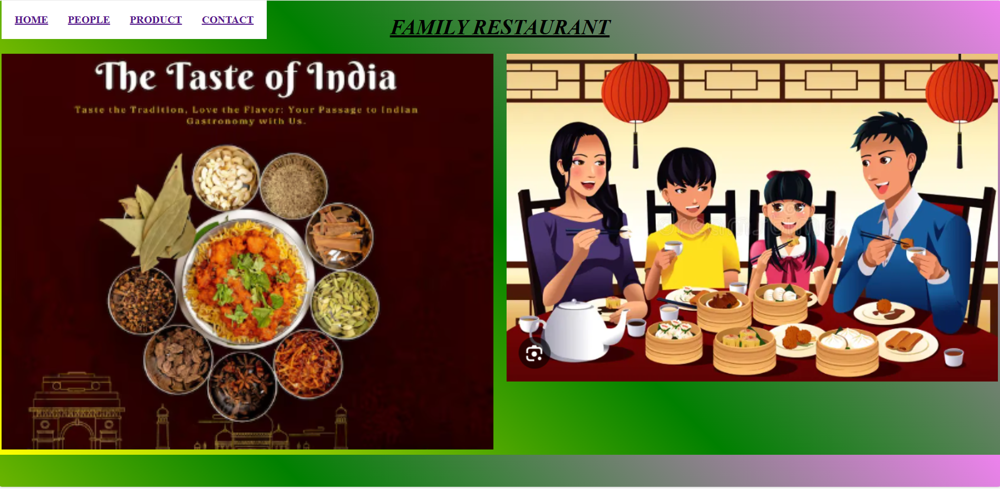
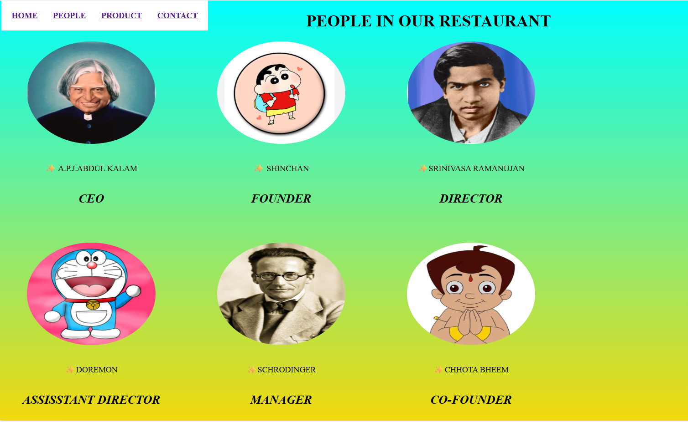
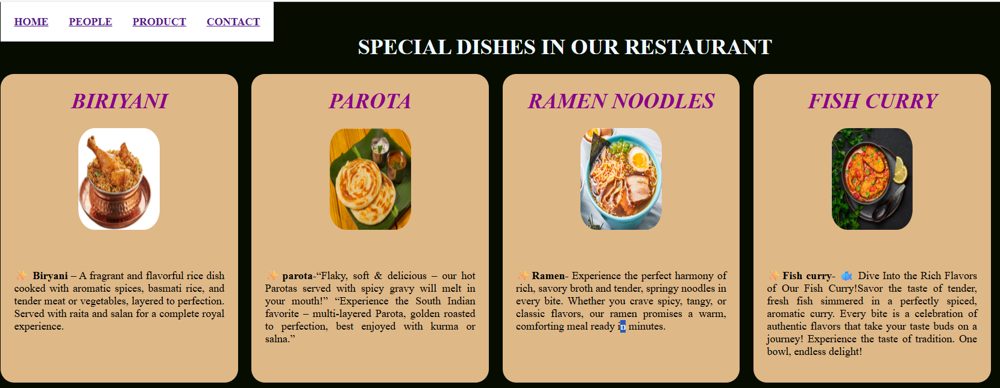
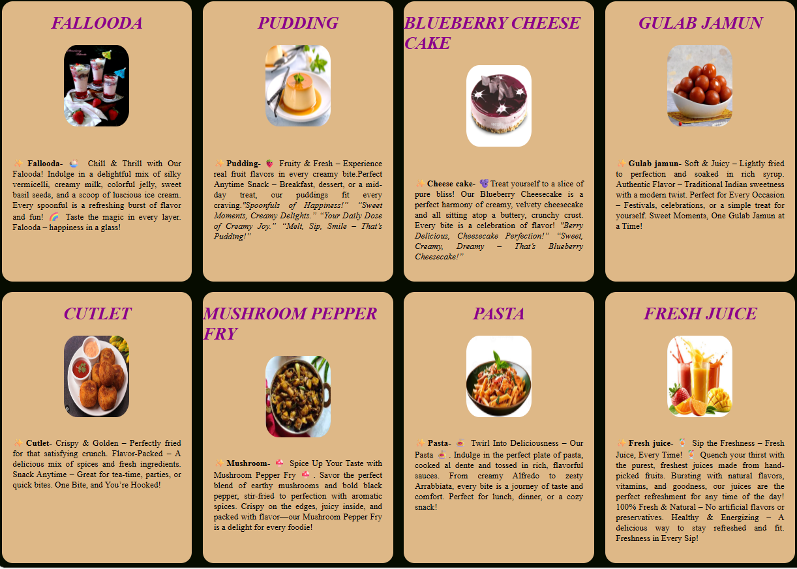
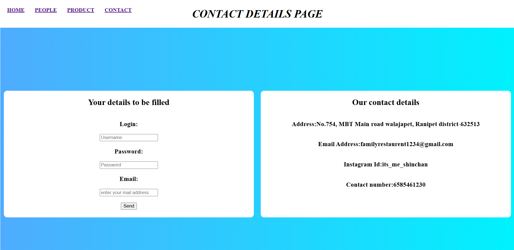

# Ex.07 Restaurant Website
# Date:
# AIM:
To develop a static Restaurant website to display the food items and services provided by them.

# DESIGN STEPS:
## Step 1:
Requirement collection.

## Step 2:
Creating the layout using HTML and CSS.

## Step 3:
Updating the sample content.

## Step 4:
Choose the appropriate style and color scheme.

## Step 5:
Validate the layout in various browsers.

## Step 6:
Validate the HTML code.

## Step 7:
Publish the website in the given URL.

# PROGRAM:
```
rest.html


<!DOCTYPE html>
<html lang="en">
<head>
    <meta charset="UTF-8">
    <meta name="viewport" content="width=device-width, initial-scale=1.0">
    <title>HOME PAGE</title>
    <style>
        body{
            background: linear-gradient(45deg,yellow,green,violet);
        }
        h2{
            text-align: right;
        }   
        .menu{
            list-style: none;
            margin: 0;
            padding: 20px;
            display: flex;
            justify-content: flex-end; 
            gap: 30px;
            background: white; 
            font-weight: bold;
            position: fixed; 
            top: 0;
        }
        h1{
            text-align: center;
            color: black;
            text-decoration: underline;
        }
        .photo{
            display: flex;
            flex-direction: row;
            gap: 20px;
        }
    </style>
</head>
<body>
    <h1><i>FAMILY RESTAURANT</i></h1>
    <div class="photo">
        
        
    </div>
    <ul class="menu">
        <li><a href="">HOME</a> </li>
        <li><a href="">PEOPLE</a></li>
        <li><a href="">PRODUCT</a></li>
        <li><a href="">CONTACT</a></li>
    </ul>
    
</body>
</html>

people.html


<!DOCTYPE html>
<html lang="en">
<head>
    <meta charset="UTF-8">
    <meta name="viewport" content="width=device-width, initial-scale=1.0">
    <title>Document</title>
    <style>
        body{
            background: linear-gradient(to bottom,cyan,gold);
        }
        .plate img{
            border-radius: 50%;
            height: 200px;
            width: 250px;
        }
        .plate{
            display: flex;
            flex-direction: column;
            height: auto;
            width: 350px;
            border-radius: 20px;
            align-items: center;
            margin-bottom: 20px;
        }
        .cup{
            display: flex;
            flex-direction: row;
            gap: 20px;
        }
        .plate-t{
            display: flex;
            flex-direction: column;
            height: auto;
            width: 350px;
            border-radius: 20px;
            align-items: center;
            margin-bottom: 10px;
        }
        .cup-t{
            display: flex;
            flex-direction: row;
            gap: 20px;
        }
        .plate-t img{
            border-radius: 50%;
            height: 200px;
            width: 250px;
        }
        .menu{
            list-style: none;
            margin: 0;
            padding: 20px;
            display: flex;
            justify-content: flex-end; 
            gap: 30px;
            background: white; 
            font-weight: bold;
            position: fixed; 
            top: 0;
        }
    </style>
</head>
<body>
    <ul class="menu">
        <li><a href="">HOME</a> </li>
        <li><a href="">PEOPLE</a></li>
        <li><a href="">PRODUCT</a></li>
        <li><a href="">CONTACT</a></li>
    </ul>
    <h1 style="text-align: center;">PEOPLE IN OUR RESTAURANT</h1>
    <div class="cup">
        <div class="plate">
            
            <p>✨ A.P.J.ABDUL KALAM<h2><i>CEO</i></h2></p>
        </div>
        <div class="plate">
            
            <p>✨ SHINCHAN <h2><i>FOUNDER</i></h2></p>
        </div>
        <div class="plate">
            
            <p>✨SRINIVASA RAMANUJAN<h2><i>DIRECTOR</i></h2></p>
        </div>
    </div>
    <div class="cup-t">
        <div class="plate-t">
            
            <p>✨DOREMON <h2><i>ASSISSTANT DIRECTOR</i></h2></p>
        </div>
        <div class="plate-t">
            
            <p>✨SCHRODINGER <h2><i>MANAGER</i></h2></p>
        </div>
        <div class="plate-t">
            
            <p>✨CHHOTA BHEEM <h2><i>CO-FOUNDER</i></h2></p>
        </div>
    </div>
</body>
</html>

food.html


<!DOCTYPE html>
<html lang="en">
<head>
    <meta charset="UTF-8">
    <meta name="viewport" content="width=device-width, initial-scale=1.0">
    <title>Document</title>
    <style>
        body{
            background-color: rgb(6, 12, 0);
        }
        .plate{
            display: flex;
            flex-direction: column;
            background-color: burlywood;
            height: auto;
            width: 350px;
            border-radius: 20px;
            align-items: center;
            margin-bottom: 20px;
        }
        .plate p{
            text-decoration: dotted;
            padding: 20px;
            text-align: justify;
            line-height: normal;
        }
        .plate img{
            height: 150px;
            width: 120px;
            border-radius: 20%;
        }
        .plate h1{
            color: darkmagenta;
            text-decoration: wavy double;
        }
        .cup{
            display: flex;
            flex-direction: row;
            gap: 20px;
        }
        .cup-t{
            display: flex;
            flex-direction: row;
            gap: 20px;
        }
        .plate-t{
            display: flex;
            flex-direction: column;
            background-color: burlywood;
            height: auto;
            width: 350px;
            border-radius: 20px;
            align-items: center;
            margin-bottom: 20px;
        }
        .plate-t p{
            text-decoration: dotted;
            padding: 20px;
            text-align: justify;
            line-height: normal;
        }
        .plate-t img{
            height: 150px;
            width: 120px;
            border-radius: 20%;
        }
        .plate-t h1{
            color: darkmagenta;
            text-decoration: wavy double;
        }
        .cup-o{
            display: flex;
            flex-direction: row;
            gap: 20px;
        }
        .plate-o{
            display: flex;
            flex-direction: column;
            background-color: burlywood;
            height: auto;
            width: 350px;
            border-radius: 20px;
            align-items: center;
        }
        .plate-o p{
            text-decoration: dotted;
            padding: 20px;
            text-align: justify;
            line-height: normal;
        }
        .plate-o img{
            height: 150px;
            width: 120px;
            border-radius: 20%;
        }
        .plate-o h1{
            color: darkmagenta;
            text-decoration: wavy double;
        }
        .menu{
            list-style: none;
            margin: 0;
            padding: 20px;
            display: flex;
            justify-content: flex-end; 
            gap: 30px;
            background: white; 
            font-weight: bold;
            position: fixed; 
            top: 0;
        }
    </style>
</head>
<body>
    <ul class="menu">
        <li><a href="">HOME</a> </li>
        <li><a href="">PEOPLE</a></li>
        <li><a href="">PRODUCT</a></li>
        <li><a href="">CONTACT</a></li>
    </ul>
    <h1 style="text-align: center; color: aliceblue;" >SPECIAL DISHES IN OUR RESTAURANT</h1>
    <div class="cup">
        <div class="plate">
            <h1><i>BIRIYANI</i></h1>
            
            <p>✨ <b>Biryani</b> – A fragrant and flavorful rice dish cooked with aromatic spices, basmati rice, and tender meat or vegetables, layered to perfection. Served with raita and salan for a complete royal experience.</p>
        </div>
        <div class="plate">
            <h1><i>PAROTA</i></h1>
            
            <p>✨<b>parota-</b>“Flaky, soft & delicious – our hot Parotas served with spicy gravy will melt in your mouth!” “Experience the South Indian favorite – multi-layered Parota, golden roasted to perfection, best enjoyed with kurma or salna.”</p>
        </div>
        <div class="plate">
            <h1><i>RAMEN NOODLES</i></h1>
            
            <p>✨<b>Ramen- </b>Experience the perfect harmony of rich, savory broth and tender, springy noodles in every bite. Whether you crave spicy, tangy, or classic flavors, our ramen promises a warm, comforting meal ready in minutes.</p>
        </div>
        <div class="plate">
            <h1><i>FISH CURRY</i></h1>
            
            <p>✨<b>Fish curry- </b>🐟 Dive Into the Rich Flavors of Our Fish Curry!Savor the taste of tender, fresh fish simmered in a perfectly spiced, aromatic curry. Every bite is a celebration of authentic flavors that take your taste buds on a journey! Experience the taste of tradition. One bowl, endless delight!</p>
        </div>
    </div>
    <div class="cup-t">
        <div class="plate-t">
            <h1><i>FALLOODA</i></h1>
            
            <p>✨<b>Fallooda- </b>🍨 Chill & Thrill with Our Falooda! Indulge in a delightful mix of silky vermicelli, creamy milk, colorful jelly, sweet basil seeds, and a scoop of luscious ice cream. Every spoonful is a refreshing burst of flavor and fun! 🌈 Taste the magic in every layer. Falooda – happiness in a glass!</p>
        </div>
        <div class="plate-t">
            <h1><i>PUDDING</i></h1>
            
            <p>✨<b>Pudding- </b>🍓 Fruity & Fresh – Experience real fruit flavors in every creamy bite.Perfect Anytime Snack – Breakfast, dessert, or a mid-day treat, our puddings fit every craving.<i>"Spoonfuls of Happiness!”
“Sweet Moments, Creamy Delights.”
“Your Daily Dose of Creamy Joy.”
“Melt, Sip, Smile – That’s Pudding!”</i></p>
        </div>
        <div class="plate-t">
            <h1><i>BLUEBERRY CHEESE CAKE</i></h1>
            
            <p>✨<b>Cheese cake- </b>🫐Treat yourself to a slice of pure bliss! Our Blueberry Cheesecake is a perfect harmony of creamy, velvety cheesecake and all sitting atop a buttery, crunchy crust. Every bite is a celebration of flavor! <i>"Berry Delicious, Cheesecake Perfection!”
“Sweet, Creamy, Dreamy – That’s Blueberry Cheesecake!”</i></p>
        </div>
        <div class="plate-t">
            <h1><i>GULAB JAMUN</i></h1>
            
            <p>✨<b>Gulab jamun- </b>Soft & Juicy – Lightly fried to perfection and soaked in rich syrup. Authentic Flavor – Traditional Indian sweetness with a modern twist. Perfect for Every Occasion – Festivals, celebrations, or a simple treat for yourself. Sweet Moments, One Gulab Jamun at a Time!</p>
        </div>
    </div>
    <div class="cup-o">
        <div class="plate-o">
            <h1><i>CUTLET</i></h1>
            
            <p>✨<b>Cutlet- </b>Crispy & Golden – Perfectly fried for that satisfying crunch. Flavor-Packed – A delicious mix of spices and fresh ingredients. Snack Anytime – Great for tea-time, parties, or quick bites. One Bite, and You’re Hooked!</p>
        </div>
        <div class="plate-o">
            <h1><i>MUSHROOM PEPPER FRY</i></h1>
            
            <p>✨<b>Mushroom- </b>🍄 Spice Up Your Taste with Mushroom Pepper Fry 🍄. Savor the perfect blend of earthy mushrooms and bold black pepper, stir-fried to perfection with aromatic spices. Crispy on the edges, juicy inside, and packed with flavor—our Mushroom Pepper Fry is a delight for every foodie!</p>
        </div>
        <div class="plate-o">
            <h1><i>PASTA</i></h1>
            
            <p>✨<b>Pasta- </b>🍝 Twirl Into Deliciousness – Our Pasta 🍝. Indulge in the perfect plate of pasta, cooked al dente and tossed in rich, flavorful sauces. From creamy Alfredo to zesty Arrabbiata, every bite is a journey of taste and comfort. Perfect for lunch, dinner, or a cozy snack!</p>
        </div>
         <div class="plate-o">
            <h1><i>FRESH JUICE</i></h1>
            
            <p>✨<b>Fresh juice- </b>🍹 Sip the Freshness – Fresh Juice, Every Time! 🍹
Quench your thirst with the purest, freshest juices made from hand-picked fruits. Bursting with natural flavors, vitamins, and goodness, our juices are the perfect refreshment for any time of the day! 100% Fresh & Natural – No artificial flavors or preservatives. Healthy & Energizing – A delicious way to stay refreshed and fit. Freshness in Every Sip!</p>
        </div>
    </div>
</body>
</html>

contact.html

<!DOCTYPE html>
<html lang="en">
<head>
    <meta charset="UTF-8">
    <meta name="viewport" content="width=device-width, initial-scale=1.0">
    <title>Document</title>
    <style>
.container {
  display: flex;              
  align-items: center;        
  height: 100vh;             
  background: linear-gradient(to right, #4facfe, #00f2fe);
}

.box {
  width: 50%;
  height: 50%;
  margin: 10px;
  background-color: white;
  border-radius: 10px;
  display: flex;
  flex-direction: column;
  align-items: center;   
  font-weight: bold;
}
.menu{
  list-style: none;
  margin: 0;
  padding: 20px;
  display: flex;
  justify-content: flex-end; 
  gap: 30px;
  background: white; 
  font-weight: bold;
  position: fixed; 
  top: 0;
}
</style>
</head>
<body>
  <ul class="menu">
        <li><a href="">HOME</a> </li>
        <li><a href="">PEOPLE</a></li>
        <li><a href="">PRODUCT</a></li>
        <li><a href="">CONTACT</a></li>
    </ul>
  <h1 style="text-align: center;"><i>CONTACT DETAILS PAGE</i></h1>
  <div class="container">
    <div class="box">
      <h2>Your details to be filled</h2>
      <h3>Login:</h3>
      <input type="text" placeholder="Username">
      <h3>Password:</h3>
      <input type="password" placeholder="Password">
      <h3>Email:</h3>
      <input type="email" placeholder="enter your mail address">
      <br>
      <button type="submit">Send</button>
    </div>
    <div class="box">
      <h2>Our contact details</h2>
      <h3>Address:No.754, MBT Main road walajapet, Ranipet district-632513</h3>
      <h3>Email Address:familyrestaurent1234@gmail.com</h3>
      <h3>Instagram Id:its_me_shinchan</h3>
      <h3>Contact number:6585461230</h3>
    </div>
  </div>
</body>
</html>

```
# OUTPUT:






# RESULT:
The program for designing software company website using HTML and CSS is completed successfully.
